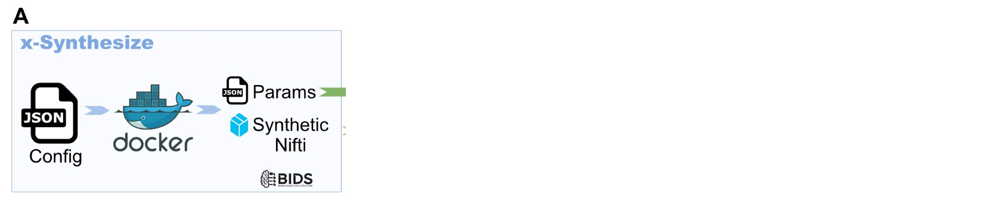
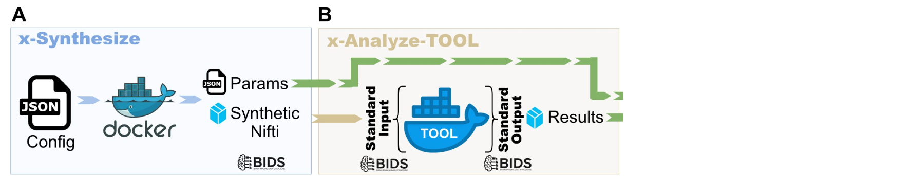
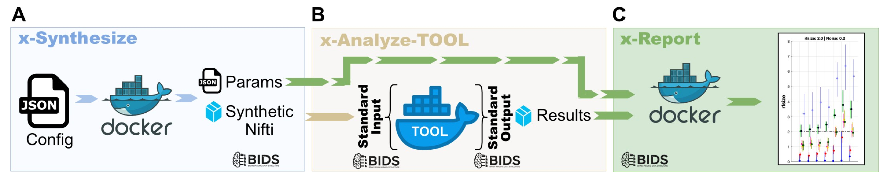
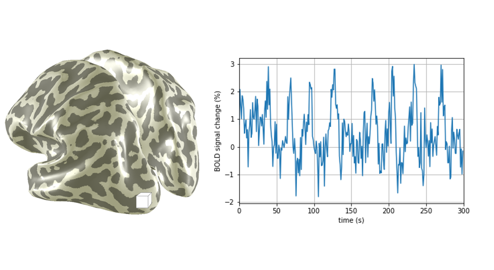
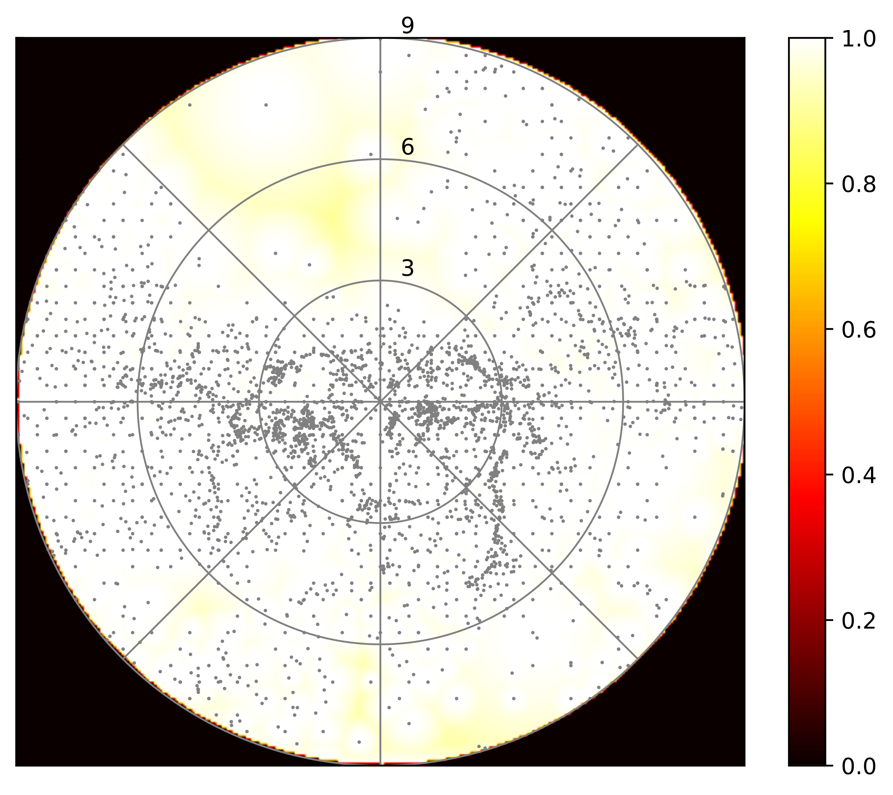
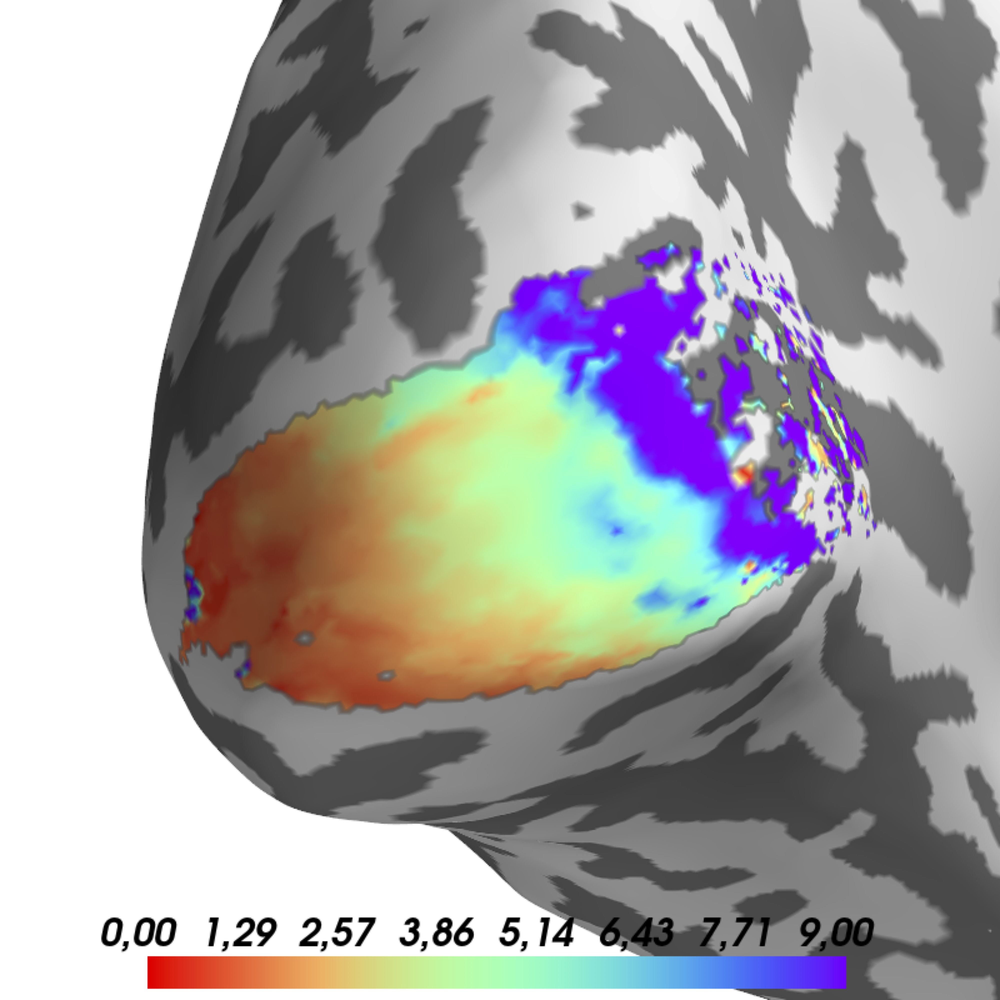
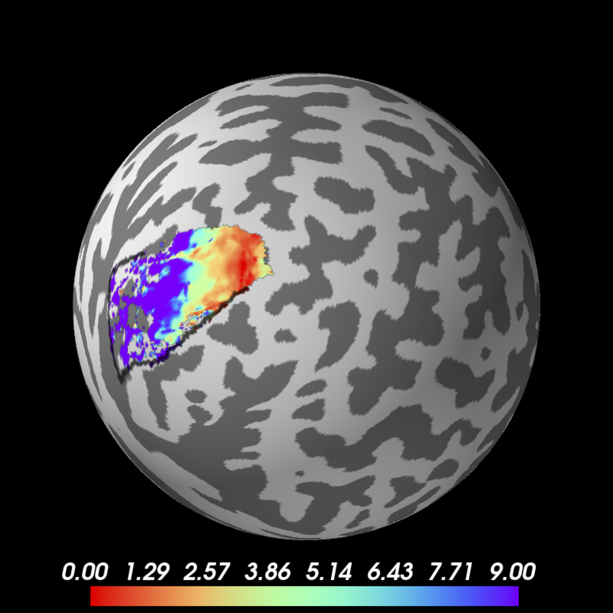

## pRF Mapping is a Robust and Reproducible Method

::: {.fragment}
### This was shown
::: {.columns}
::: {.column width=30%}
- [Linhardt (2022)](https://doi.org/10.1523/eneuro.0087-22.2022){target="_blank"}
- [Himmelberg (2021)](https://doi.org/10.1016/j.neuroimage.2021.118609){target="_blank"}
- [Benson (2018)](https://doi.org/10.1167/18.13.23){target="_blank"}
- [Zeidman (2017)](https://doi.org/10.1016/j.neuroimage.2017.09.008){target="_blank"}
:::

::: {.column width=30%}
- [van Dijk (2016)](https://doi.org/10.1016/j.neuroimage.2016.09.013){target="_blank"}
- [Senden (2014)](https://doi.org/10.1371/journal.pone.0114054){target="_blank"}
- [Binda (2013)](https://doi.org/10.1167/13.7.13.doi){target="_blank"}
- [Zuiderbaan (2012)](https://doi.org/10.1167/12.3.10){target="_blank"}, ...
:::
:::
:::

::: {.fragment}
### However...
::: {.incremental}
Results remain sensitive to variations in

- stimulus design (e.g. [Chang (2025)](https://doi.org/10.1167/jov.25.1.5){target="_blank"}, [Pawloff (2023)](https://doi.org/10.1167/tvst.12.3.6){target="_blank"}, [Linhardt (2021)](https://doi.org/10.1016/j.neuroimage.2021.118240){target="_blank"}, [Alvarez(2025)](https://doi.org/10.3389/fnhum.2015.00096){target="_blank"})

- preprocessing (e.g. [Linhardt (2025)](https://doi.org/10.1002/hbm.70140){target="_blank"})

- analysis environment and software (e.g. [Lerma-Usabiaga (2020)](https://doi.org/10.1371/journal.pcbi.1007924){target="_blank"})
:::
:::

::: {.notes}
Why do we need containerization, standardization, reproducible analyses
:::

## What I found when I started
::: {.fragment}
Have a look on the analysis of the last study
:::

::: {.fragment}

:::

::: {.fragment}
This is not a problem, just check the scripts folder
:::


## What I found when I started

::: {.fragment}

:::

::: {.fragment}
and it was running on one server only...
:::

::: {.fragment}
with the correct user...
:::

::: {.notes}
Have you ever tried updating MATLAB or Python...
Took me a lot of effort to reproduce old analysis and this should be more straightforward
:::


## What I did not find when I started



and it was running on one server only...

with the correct user...


## Containerized pRF Analysis Framework {.nostretch}

::: {.fragment}
{width="80%"}
:::


## Containers
::: {.fragment}
- Docker and/or Singularity
{.absolute top=6% right=10% width="400px"}
{.absolute top=30% right=10% width="400px"}
:::

::: {.fragment}
- Containers encapsulate all necessary\
programs libraries and code snippets
:::

::: {.incremental}
- Easy to use
- Reproducible even on different OS
- Still running in years
:::


## Containerized pRF Analysis Framework {.nostretch}

::: {.fragment}
{width="80%"}
:::


## Containerized pRF Analysis Framework {.nostretch}

::: {.fragment}
A. Create synthetic data with given noise models
{.absolute bottom=20% left=3% width="110%"}
:::

::: {.fragment}
B. Analyze the data with different tools
{.absolute bottom=20% left=3% width="110%"}
:::

::: {.fragment}
C. Visualize the data
{.absolute bottom=20% left=3% width="110%"}
:::

::: {.fragment}
{.absolute bottom=20% left=-4% width="40%"}
:::


## pRF Pipeline
{.absolute top=10% left=0% width="100%"}

::: {.fragment}
{.absolute top=10% left=0% width="100%"}
:::

::: {.fragment}
{.absolute top=10% left=0% width="100%"}

::: {.fragment .fade-in-then-out .absolute top=40% left=10%, width=90%}
BIDS: [bids.neuroimaging.io](https://bids.neuroimaging.io){target="_blank"}
```bash {.dark-terminal style="max-height:430px; overflow-y:auto;" code-line-numbers="false"}
.
└── BIDS
    ├── dataset_description.json
    ├── derivatives
    |   ├── fmriprep
    |   ├── prfprepare
    |   ├── prfanalyze
    |   └── prfresult
    ├── sourcedata
    ├── sub-001
    |   ├── ses-001
    |   |   ├── anat
    |   |   ├── fmap
    |   |   └── func
    |   └── ses-002
    |       ├── anat
    |       ├── fmap
    |       └── func
    ├── sub-002
    |   └── ses-001
    |       ├── anat
    |       ├── fmap
    |       └── func
    └── sub-003
        └── ses-001
            ├── anat
            │   ├── sub-003_ses-001_T1w.nii.gz
            │   └── sub-003_ses-001_T1w.json
            ├── fmap
            │   ├── sub-003_ses-001_dir-1_epi.nii.gz
            │   └── sub-003_ses-001_dir-1_epi.json
            └── func
                ├── sub-003_ses-001_task-bar_run-01_bold.nii.gz
                ├── sub-003_ses-001_task-bar_run-01_bold.json
                ├── sub-003_ses-001_task-bar_run-02_bold.nii.gz
                └── sub-003_ses-001_task-bar_run-02_bold.json
```
:::
:::

::: {.fragment}
{.absolute top=10% left=0% width="100%"}

::: {.fragment .fade-in-then-out .absolute top=40% left=10%, width=90%}
fMRIPrep: [fmriprep.org](https://fmriprep.org){target="_blank"}

Open-source state-of-the-art fMRI preprocessing
:::
:::

::: {.fragment}
{.absolute top=10% left=0% width="100%"}

::: {.fragment .fade-in-then-out .absolute top=40% left=10%, width=90%}
- Masking using [Wang (2015)](https://doi.org/10.1093/cercor/bhu277){target="_blank"} or [Benson (2024)](https://doi.org/10.1371/journal.pcbi.1003538){target="_blank"} atlas, custom mask, full brain
- rearranges data to the analysis standard input
- reconstructs stimulus from vistadisp log
:::
:::

::: {.fragment}
{.absolute top=10% left=0% width="100%"}

::: {.fragment .fade-in-then-out .absolute top=40% left=10%, width=90%}
Run pRF analysis in one of these tools:

   - Vistasoft [github.com/vistalab/Vistasoft](https://github.com/vistalab/vistasoft){target="_blank"}
   - analyzePRF [github.com/cvnlab/analyzePRF](https://github.com/cvnlab/analyzePRF){target="_blank"}
   - popeye [github.com/kdesimone/popeye](https://github.com/kdesimone/popeye){target="_blank"}
   - AFNI [github.com/afni/AFNI](https://github.com/afni/afni){target="_blank"}

::: {style="opacity:0.4"}
   - SamSrf [github.com/samsrf/SamSrf](https://github.com/samsrf/SamSrf){target="_blank"}
   - GEM-pRF
:::
:::
:::

::: {.fragment}
{.absolute top=10% left=0% width="100%"}

::: {.fragment .absolute top=38% left=5% style="text-align:center;"}
{height=350px}
:::

::: {.fragment .absolute top=38% left=35% style="text-align:center;"}
{height=350px}
:::

::: {.fragment .absolute top=38% left=65% style="text-align:center;"}
{height=350px}
:::

::: {.fragment .absolute top=78% left=10%}
- Save results it to original format
- Based on PRFclass handeling the data [github.com/dlinhardt/PRFclass](https://github.com/dlinhardt/PRFclass){target="_blank"}
:::
:::

## How to use Containers

:::: {.columns}

::: {.column width="50%"}
::: {.fragment}
Config File

```bash {.dark-terminal style="max-height:550px; overflow-y:auto;" code-line-numbers="false"}
{
    "subjects"                : "t001",
    "sessions"                : "all",
    "etcorrection"            : false,
    "force"                   : false,
    "custom_output_name"      : "",
    "fmriprep_legacy_layout"  : false,
    "forceParams"             : "",
    "use_numImages"           : false,
    "verbose"                 : true,
    "config": {
    	"analysisSpace"       : "fsaverage",
        "average_runs"        : true,
        "output_only_average" : false,
        "rois"                : "all",
        "atlases"             : "benson,wang",
        "fmriprep_analysis"   : "01"
 	}
}

```
:::
:::

::: {.column width=50%}
::: {.fragment}
Calling the Container

```bash {.dark-terminal style="max-height:550px; overflow-y:auto;" code-line-numbers="false"}
#!/bin/sh

# input folder:
baseP=$(dirname "$(dirname "$(readlink -f "$0")")")

unset PYTHONPATH; singularity run \
	-H $baseP/singularity_home \
	-B $baseP/BIDS/derivatives/fmriprep:/flywheel/v0/input \
	-B $baseP/BIDS/derivatives:/flywheel/v0/output  \
	-B $baseP/BIDS:/flywheel/v0/BIDS  \
	-B $baseP/config/prfprepare.json:/flywheel/v0/config.json \
	--cleanenv /ceph/mri.meduniwien.ac.at/departments/physics/fmrilab/lab/prfprepare/prfprepare_6.1.sif

```
:::
:::
:::

::: {.fragment}
Example dataset with all scripts (to be updated): [osf.io/seh6b](https://osf.io/seh6b/){target="_blank"}
:::

## Conclusion
### Key Takeaways

::: {.fragment}
- **Standardize** your data stucture using BIDS and your workflow for reproducibility
:::

::: {.fragment}
- **Automate** the processing using containers as [fMRIPrep](fmriprep.org){target="_blank"}, [prfprepare](https://github.com/fmriat/prfprepare){target="_blank"}, [prfanalyze](https://github.com/vistalab/prfmodel){target="_blank"} and [prfresult](https://github.com/fmriat/prfresult){target="_blank"}

::: {.fragment}
- **Collaborate** by sharing fully documented datasets and transparent analysis workflows, enabling direct comparison of results
:::

::: {.fragment .absolute bottom=25%}
### Get in touch!
[david.linhardt@meduniwien.ac.at](mailto:david.linhardt@meduniwien.ac.at)

Presentation on GitHub: [github.com/dlinhardt](https://github.com/dlinhardt/2025-05-02_pRF_workshop_london){target="_blank"}
:::
