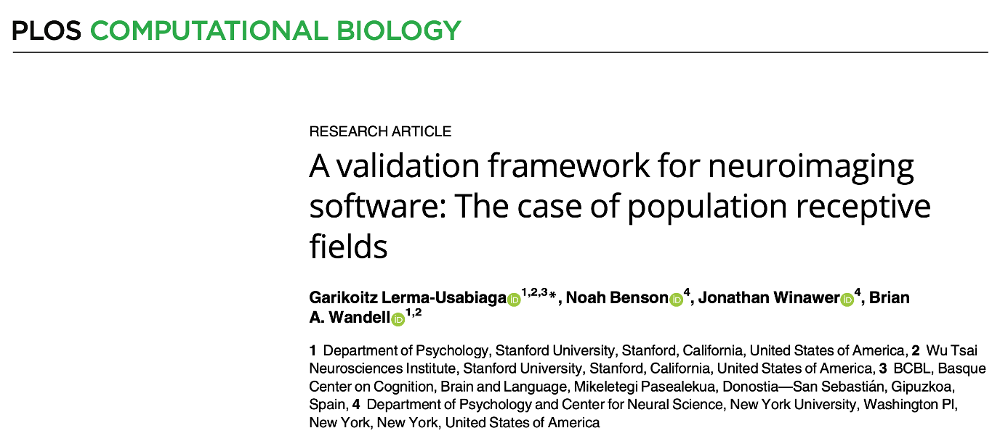
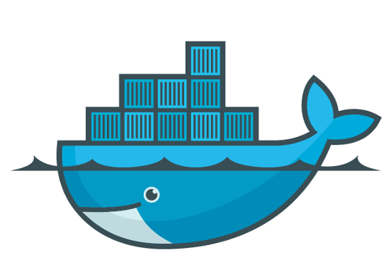

# Why we need it

::: {.notes}
Why do we need containerization, standardization, reproducvible analyses
:::

## What I found when I started
::: {.fragment}
Have a look on the analysis of the last study
:::

::: {.fragment}

:::

::: {.fragment}
This is not a problem, just check the scripts folder
:::

## What I found when I started

::: {.fragment}

:::

::: {.fragment}
and it was running on one server only...
:::

::: {.fragment}
with the correct user...
:::

::: {.notes}
Have you ever tried updating MATLAB or Python...
Took me a lot of effort to reproduce old analysis and this should be more straightforward
:::

## What I did not find when I started



and it was running on one server only...

with the correct user...

# Containerized pRF Analysis Framework {.nostretch}

::: {.fragment}
{width="80%"}
:::

## Containers
::: {.fragment}
- Docker and/or Singularity
{.absolute top=0vh right=0vh width="300px"}
{.absolute top=20vh right=0vh width="300px"}
:::

::: {.fragment}
- Containers encapsulate all necessary\
programs libraries and code snippets
:::

::: {.incremental}
- Easy to use
- Reproducible even on different OS
- Still running in years
:::

## Containerized pRF Analysis Framework {.nostretch}

::: {.fragment}
{width="80%"}
:::
